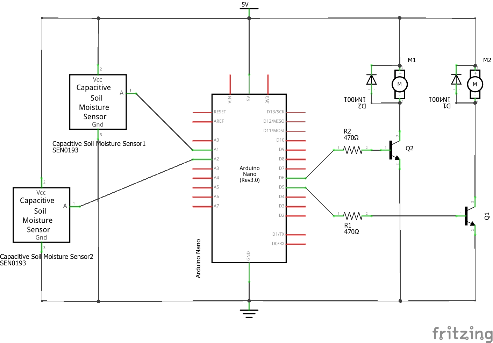
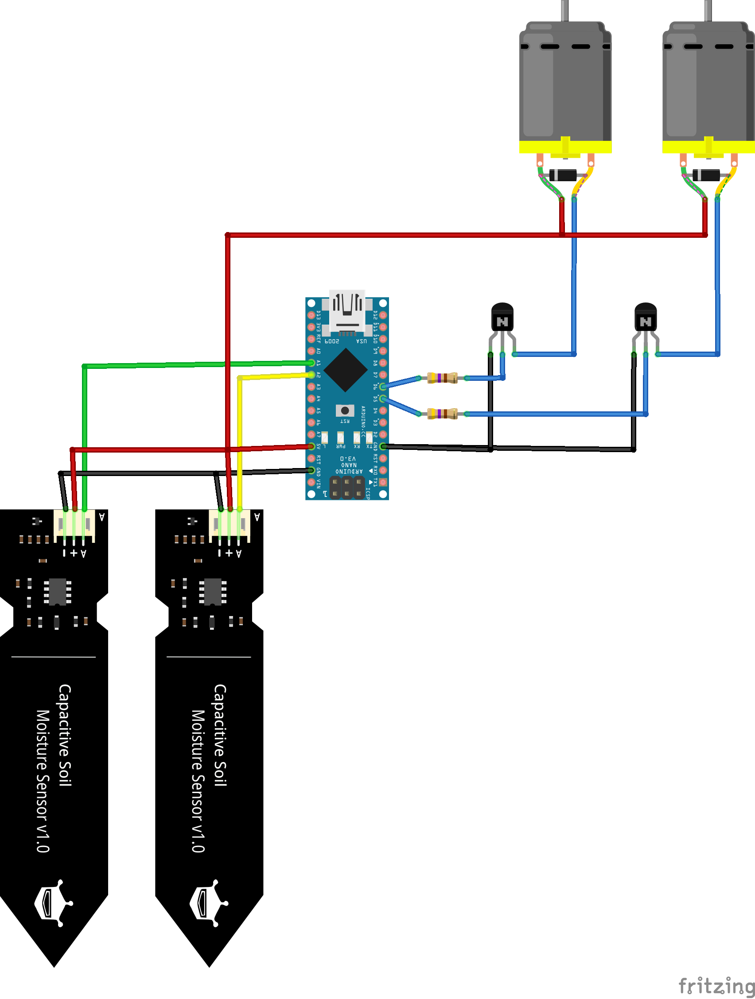

# Watering system

Watering system for the automated watering on demand of plants.  Capacitive soil moisture sensors are put into the soil of the plants and monitor the moisture levelof the soil. The sensors provide the signal to an Arduino Nano microcontroller. The Arduino Nano controls small pumps by switching them on and off via bipolar transistors. The transistors are used as electronic switches. I have soldered the transistors, resistors, and some connectors for Dupont wires to a tiny PCB and put everything into watertight (IP67) distribution box for electrical wires. You can find such a box in your local building supply shop like Home Depot, Hornbach, Obi, Bauhaus, Jumbo, etc. 

The Arduino Nano provides enough current to supply my two pumps. However, you can potentially increase the number of sensors and pumps. In this case, you should probably power the setup separately by an external power supply.

I use the configuration of two sensors and two pumps with a larger planter of flowers. 

The project is derived and inspired from the German "Make" magazine. Their project can be found here: https://github.com/MakeMagazinDE/Selbstbaugiessautomat  

# Bill of materials

* Arduino Nano
* BC337 bipolar transistors
* 470 Ohm resistors
* [1N4001 diode](https://www.onsemi.com/pdf/datasheet/1n4001-d.pdf) (or similar)
* 3 V DC miniature pumps
* capacitive soil moisture sensors
* USB power supply, 5 V DC, 1 A (similar to a phone charger)
* Mini USB cable (to power everything via the Arduino Nano)

# Circuit setup

The following picture shows the schematic of the circuit. The resistors R1 and R2 limit the current from the Arduino Nano to the transistors Q1 and Q2 and protect both components. The diodes D1 and D2 protect the pump motors M1 and M2 from the peak of the induced inverse voltage when the motors are switching off.

The following picture shows the illustration of the circuit. Please note that the 5 V power supply is not illustrated and should be connected to the red and black wires. The pumps can be connected with either polarity.

